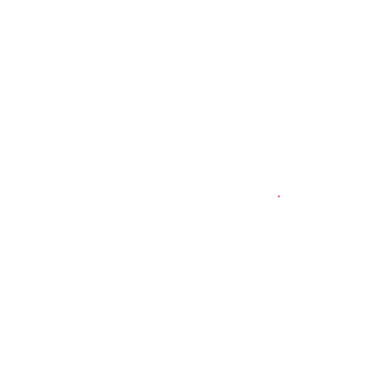
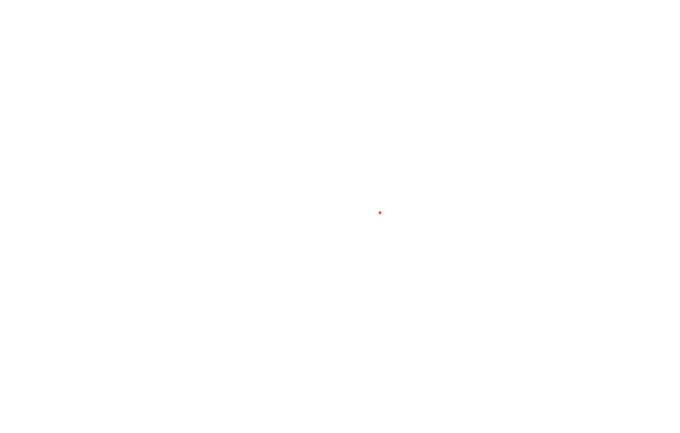

# 카메라 캘리브레이션 및 렌즈 왜곡 보정

## 프로젝트 설명
본 프로젝트는 Python과 OpenCV를 활용하여 카메라 캘리브레이션과 렌즈 왜곡 보정을 수행합니다. 체스보드 패턴을 촬영한 동영상을 분석하여 특정 카메라의 내부 파라미터를 계산하고, 이를 적용하여 기하학적으로 왜곡된 이미지를 올바르게 폅니다.

## 주요 기능
* **카메라 캘리브레이션:** 체스보드 동영상에서 프레임을 추출하고 내부 코너를 검출하여 카메라 매트릭스와 왜곡 계수를 계산합니다.
* **왜곡 보정:** 계산된 내부 파라미터를 바탕으로 원본 동영상 프레임의 왜곡을 물리적으로 펴고, 보정 전후를 비교할 수 있도록 시각화합니다.

## 카메라 캘리브레이션 결과
6x9 내부 코너 체스보드를 캡처한 71장의 이미지를 바탕으로 수행한 캘리브레이션 결과입니다:

* **적용된 이미지 수:** 71장
* **RMS 에러:** 1.1619960248827357
* **카메라 매트릭스 (K):**
    [[965.26206038,   0.        , 474.37583195],
     [  0.        , 963.93652117, 621.9254383 ],
     [  0.        ,   0.        ,   1.        ]]
* **초점 거리:**
    * fx = 965.2620603798347
    * fy = 963.936521169752
* **주점:**
    * cx = 474.37583194502366
    * cy = 621.9254383005533
* **왜곡 계수 (k1, k2, p1, p2, k3):**
    [-0.09403047,  0.99054163,  0.00218981,  0.00667265, -2.03771052]

## 왜곡 보정 데모

